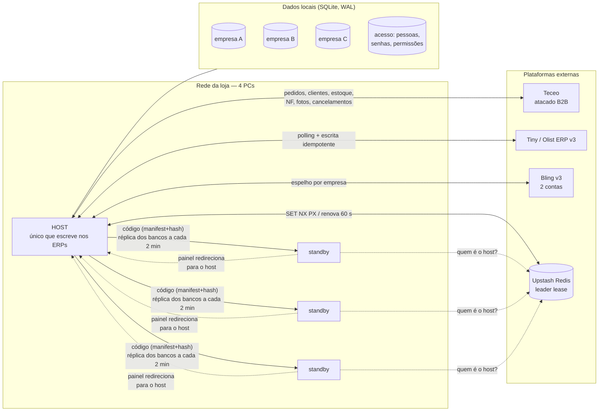

# Integração multi-ERP para um grupo de moda — estudo de caso

> Sistema de integração entre uma plataforma B2B de atacado (**Teceo**) e o ERP **Tiny/Olist**, que cresceu para um painel operacional de **três empresas** e **três plataformas** (Teceo, Tiny e Bling), rodando em quatro computadores com failover automático e sem servidor dedicado.
>
> Concebido, arquitetado e implementado por uma pessoa, em parceria com IA. Cinco semanas da primeira chamada de API ao sistema completo em produção; oito semanas até o estado descrito aqui (27/07 → 18/09/2026).

**English summary at the end of this file.**

---

## Por que este repositório existe

O código pertence à empresa onde o sistema roda (Lei 9.609/98, art. 4º), então ele não está aqui. O que está aqui é o que costuma importar mais numa conversa técnica: **o problema, as decisões, os erros que doeram e o que foi construído para que não voltassem**.

Todos os dados foram anonimizados: nada de nomes de clientes, documentos, valores financeiros ou identificadores de máquinas. Os nomes das plataformas (Teceo, Tiny/Olist, Bling, Nuvemshop) são produtos públicos e ficam.

## O problema

Um grupo familiar com três empresas de moda (atacado infantil, varejo adulto e uma terceira marca) migrou simultaneamente de plataforma de e-commerce e de ERP. A plataforma nova de atacado (Teceo) precisava conversar com o ERP novo (Tiny) — pedidos, clientes, estoque, notas fiscais, fotos, cancelamentos — e a fornecedora não entregava esse conector.

A integração inteira, prevista para uma equipe, ficou com uma única pessoa, que também operava o estoque e o atendimento no dia a dia. Restrições reais do ambiente:

| Restrição | Consequência no desenho |
|---|---|
| Sem servidor: só os PCs da loja, que desligam à noite e no fim de semana | Serviço roda em **qualquer** PC, com eleição automática de quem manda (host/standby) |
| Cota de **60 req/min** no Tiny, compartilhada entre o serviço e as pessoas usando o painel | Limitador local, prioridade para quem está clicando, cache de catálogo, cursores de paginação |
| Token OAuth do Tiny que morre se ninguém renovar por 1 dia | Keep-alive rotativo e reautorização assistida |
| Estoque físico contado à mão, notas fiscais que às vezes não baixam estoque, produtos cadastrados errado no ERP | Livro-razão local de cada escrita, reconciliação e "guardas" que seguram o que parece errado |
| Três empresas que **não podem misturar um único dado** | Um arquivo de banco por empresa; identidade num quarto arquivo; separação provada por script |

## Arquitetura em uma imagem

Detalhes em [`docs/02-arquitetura.md`](docs/02-arquitetura.md).

## O que o sistema faz hoje

**Integração Teceo ↔ Tiny (empresa de atacado)**
Pedidos aprovados na Teceo viram pedidos no Tiny em até 60 s, com o cliente criado ou casado por documento. Edições e cancelamentos são espelhados nos dois sentidos, com proteção contra eco e contra pedido já faturado. Estoque sincroniza Tiny → Teceo por delta, com uma "guarda" que impede escrita duplicada e uma retomada automática que decide sozinha o que fazer quando o processo cai no meio. Fotos vão Teceo → Tiny (e foram convertidas de link externo para imagem hospedada, driblando um limite não documentado da API). Notas fiscais que o ERP se recusa a lançar são baixadas pela integração, item a item, com registro imediato.

**Painel operacional**
Status e saúde de cada ciclo com alerta nativo do Windows; contagem de estoque que grava nas duas plataformas de uma vez, inclusive por planilha offline; busca por descrição em 0,02 s a partir do catálogo local; histórico de toda alteração de saldo com origem e autor; "onde está a peça" (quais pedidos seguram uma variação, com a reserva consultada ao vivo); relatórios de ruptura de grade, curva ABC, estoque parado por nota fiscal, corte de pedido, perfil de compra por cliente e previsão de perdas por grade furada.

**Multi-empresa**
As outras duas empresas do grupo, que usam Bling (uma delas com loja física, feira e Nuvemshop), entraram no mesmo sistema com bancos fisicamente separados, cliente de API por conta (cada uma com sua fila de 2 req/s), login único por pessoa com papel e permissões por empresa, e as mesmas telas adaptadas ao varejo.

**Pedidos, notas fiscais e financeiro nas três empresas**
Tela de pedidos por empresa a partir do espelho local (custo de API zero), com edição que grava no ERP de varejo sob prévia obrigatória, selo de estoque por item, impressão A4 e planilha offline; aba de notas fiscais com as situações mapeadas por ERP (os dois usam números diferentes para "cancelada"); contas a receber, a pagar e caixa espelhados do ERP com lançamentos manuais; relatórios com período personalizado e folha de impressão por relatório; conferência diária automatizada dos relatórios contra os dois ERPs, dia a dia.

**Operação em 4 PCs sem servidor**
Cada PC sobe o serviço no logon; um cadeado na nuvem (leader lease com TTL de 3 min) decide quem é o host; os demais ficam em standby, redirecionam o painel para o host, baixam o código novo pela rede (hash por arquivo), mantêm réplica dos bancos para assumir com dados recentes e recebem o cadastro de usuários linha a linha a cada 2 min. Um agente de bandeja, compilado com o `csc` que já vem no Windows, religa o serviço e recebe ordens de manutenção protegidas por senha mestre. A aba de saúde vigia os ciclos **e** as 43 telas.

## Os problemas que valeram o projeto

Cada um tem um post-mortem em [`docs/04-problemas-dificeis.md`](docs/04-problemas-dificeis.md). Resumo:

1. **Baixa de nota fiscal deduzindo em dobro.** A nota era marcada como "feita" só no fim do lote; qualquer reinício no meio reprocessava tudo em cima do saldo já reduzido. 60 SKUs afetados. Virou um livro-razão por item, uma guarda de escrita com chave de idempotência obrigatória na assinatura da função e uma retomada automática testada em 8 cenários.
2. **Reserva fantasma no Tiny.** Produtos cadastrados como "com variações" sem nenhuma variação travavam o lançamento de estoque da nota inteira — e, sem esse lançamento, a reserva do pedido nunca era consumida. Descoberto por experimento controlado; a ferramenta de reparo teve quatro erros num dia, dois deles em produção, e ganhou as regras que hoje valem para toda escrita externa.
3. **Split-brain no leader lease.** A tolerância à perda do Redis contava a partir da primeira falha, não da última renovação bem-sucedida: janela de ~60 s com dois hosts escrevendo. Provado por simulação, corrigido, provado de novo.
4. **Pedido duplicado por UUID recriado.** A Teceo recria o identificador do pedido na segunda etapa de aprovação; o vínculo por UUID quebrava. Passou a herdar o vínculo pelo código do pedido.
5. **Saldo pulando 16 ↔ 0.** Dois produtos ativos no ERP com o mesmo SKU; cada PC que virava host resolvia para um deles. A sincronia passou a congelar SKUs duplicados e avisar.
6. **Estoque fantasma que nasceu no cadastro.** Produtos criados no ERP já com saldo alto e sem nota de entrada foram vendidos. Nasceu a "guarda de produto novo": SKU visto pela primeira vez com saldo alto é publicado como *não vendável* até um clique de liberação.
7. **Duas brechas de segurança achadas em auditoria própria**: uma migração que recriava uma conta de dono com a senha antiga a cada requisição, e uma rota administrativa que passava sem sessão. Ambas fechadas no mesmo dia.
8. **Banco corrompido por encerramento forçado.** Único arquivo ainda em `journal_mode=delete`; migrado para WAL depois de validar que backup e réplica (via `VACUUM INTO`) continuavam consistentes.
9. **O lançamento tardio de nota antiga come o estoque.** A única alavanca do ERP para soltar reserva presa também deduz o saldo — no dia da chamada, em cima de uma contagem física já feita. 113 SKUs negativos, 100 sem nenhuma dedução nossa. Virou um lote com invariante (`saldo final = saldo inicial` por SKU, ou para) e, ao fim, um ERP sem saldo negativo nem reserva presa.
10. **95 pais órfãos escondidos por dois campos com o mesmo nome** (`tipo` × `tipoVariacao`). Todas as varreduras anteriores olhavam o balde errado. 95/95 migrados em lote, zero erro.
11. **Varredura de estoque pendurada três dias.** Não caía: 20 mil linhas de "rate limit" num dia sem nenhum reinício. Três causas somadas (fome artificial de "painel em uso", efeito manada no 429 sem teto, cedência por SKU) e um segundo erro meu no teto adaptativo — tudo medido, corrigido e provado por simulação.
12. **Login caiu porque o host do dia tinha o banco de acesso vazio** — e a blindagem escrita no dia foi sobrescrita pelo ciclo de atualização (o código anda do host para os standbys, nunca ao contrário). Cadastro passou a ser sincronizado linha a linha.
13. **"Cancelar devolveu estoque"** — era a nossa própria regra da cesta, e a compensação foi o erro. Num sistema com automações próprias, conferir o resultado não basta: é preciso conferir a **autoria**. Registrado com o nome que tem.
14. **Uma cópia velha do `server.ts` apagou telas inteiras e nada acusou.** Nasceu o verificador de 43 rotas, rodando como ciclo de saúde.

## Números

| | |
|---|---|
| Tempo do primeiro contrato de API ao go-live em produção | ~2 semanas (27/07 → 10/08/2026) |
| Tempo até o sistema completo (3 empresas, 4 PCs, agente) | ~5 semanas |
| Tempo até o estado atual (pedidos, notas, financeiro e relatórios nas 3; ERP sem negativo nem reserva presa) | ~8 semanas |
| Empresas · plataformas integradas · PCs | 3 · 4 (Teceo, Tiny, Bling ×2 contas, Nuvemshop como canal) · 4 |
| SKUs sob sincronização | ~1.300 na plataforma B2B; ~2.700 no catálogo do ERP; ~2.500 na segunda empresa |
| Dependências de runtime | **zero** (Node 26 com TypeScript nativo e `node:sqlite`) |
| Testes | 49 unitários + harness com ERP falso (7 cenários) + 10 simuladores de mecanismo em banco descartável + verificador de 43 rotas + conferência diária relatórios × 2 ERPs × 3 empresas |
| Scripts operacionais versionados | ~350 (diagnóstico, reparo com prévia obrigatória e livro-razão, migração em lote, conferência) |
| Paginação de estoque na Teceo | 966 chamadas / ~2h30 → 28 páginas / 14 s (cursor decifrado) |
| Busca no painel | 30 s–3 min → 0,02 s (catálogo local + prioridade interativa) |
| Fotos convertidas de externa para hospedada | 290 de 454 (limite de 2 MB da API) |
| Reservas presas resolvidas sem tocar saldo (14–18/09) | 1.161 (739 por nota + 348 por cancelamento + 74 nos abertos) — saldo idêntico em todas |
| Documentos de trabalho datados que originaram este repositório | 100 |

Mais em [`docs/07-metricas.md`](docs/07-metricas.md).

## Stack e escolhas

Node.js 26 rodando TypeScript nativo, sem transpilação e sem `node_modules` em runtime. SQLite via `node:sqlite`, um arquivo por empresa, em WAL. HTTP com o módulo padrão; HTML gerado no servidor com um componente de "casca" compartilhado; Chart.js servido localmente (a loja não pode depender de CDN). Redis (Upstash, REST) apenas para o cadeado de host. OAuth2 com o Tiny e com o Bling. Agente de bandeja em C# compilado no próprio Windows. PowerShell e `.cmd` para instalação e manutenção.

O porquê de cada escolha está em [`docs/03-decisoes-tecnicas.md`](docs/03-decisoes-tecnicas.md).

## Índice da documentação

| Arquivo | Conteúdo |
|---|---|
| [`docs/01-contexto-e-problema.md`](docs/01-contexto-e-problema.md) | O negócio, a migração dupla, o que precisava existir e por que ninguém entregava |
| [`docs/02-arquitetura.md`](docs/02-arquitetura.md) | Módulos, ciclos, host/standby, leader lease, réplica, auto-update, agente |
| [`docs/03-decisoes-tecnicas.md`](docs/03-decisoes-tecnicas.md) | Decisões no formato "contexto → opções → escolha → consequência" |
| [`docs/04-problemas-dificeis.md`](docs/04-problemas-dificeis.md) | 20 post-mortems |
| [`docs/05-confiabilidade.md`](docs/05-confiabilidade.md) | Guarda de estoque, retomada automática, harness de simulação, regras para escrita externa |
| [`docs/06-linha-do-tempo.md`](docs/06-linha-do-tempo.md) | Semana a semana, 27/07 → 18/09 |
| [`docs/07-metricas.md`](docs/07-metricas.md) | Números e como foram medidos |
| [`docs/08-comportamentos-nao-documentados-das-apis.md`](docs/08-comportamentos-nao-documentados-das-apis.md) | O que as APIs do Tiny, da Teceo e do Bling fazem e a documentação não diz |
| [`CURRICULO.md`](CURRICULO.md) | Como isso vira linhas de currículo e de LinkedIn (PT e EN) |

## Sobre o uso de IA

Este sistema foi desenvolvido em parceria com um assistente de IA (Claude), usado como par de programação: exploração de APIs, redação de código, revisão, simulações e documentação. As decisões de produto, as regras de negócio, os testes em produção, a operação e a responsabilidade pelo resultado foram humanos. Declarar isso foi decisão do autor — sinceridade em primeiro lugar.

## Autor

**[seu nome]** — [github.com/igv8101](https://github.com/igv8101)

Formação em Ciência da Computação, técnico em redes, pós-graduação em Ciência de Dados e em Inteligência Artificial. Procurando trabalhar com engenharia de dados / IA aplicada.

---

## English summary

**Multi-ERP integration for a family-owned fashion group — case study.** A one-person project (built in partnership with AI) that connected a B2B wholesale platform (Teceo) to an ERP (Tiny/Olist) and grew into an operational panel for three companies and three platforms, running on four ordinary Windows PCs with no dedicated server.

Highlights: leader election through a Redis lease (with a split-brain window found by simulation and fixed), code auto-update, database replication and row-level user-store sync over the LAN, an idempotent "stock write guard" with automatic resumption after crashes (validated against a fake-ERP harness with 7 failure scenarios), checkpointed stock sweeps, reverse-engineered undocumented API behaviours (pagination cursors, attachment limits, reservation release, two type fields with overlapping names hiding 95 broken products), a same-day fix of two security flaws found in self-audit, per-company physical data separation with a unified identity store, orders / invoices / finance / reports for all three companies, a route checker running as a health cycle, and 20 written post-mortems — including the ones where the mistake was mine.

Stack: Node.js 26 with native TypeScript, zero runtime dependencies, `node:sqlite` in WAL mode, OAuth2, Upstash Redis, a C# tray agent compiled with the Windows-bundled compiler. Timeline: ~2 weeks from first API call to production, ~5 weeks to the full system, ~8 weeks to the state described here (27 Jul → 18 Sep 2026). The source code belongs to the company and is not published; this repository contains the anonymised engineering write-up.
