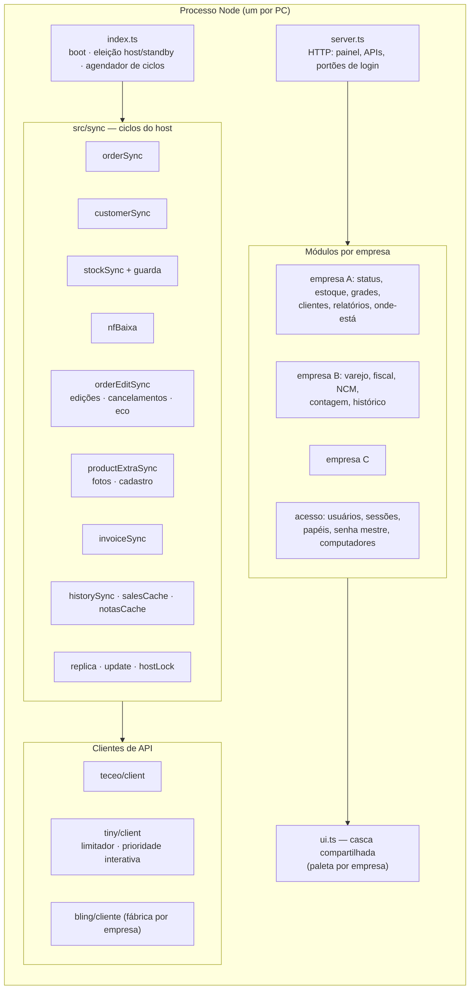
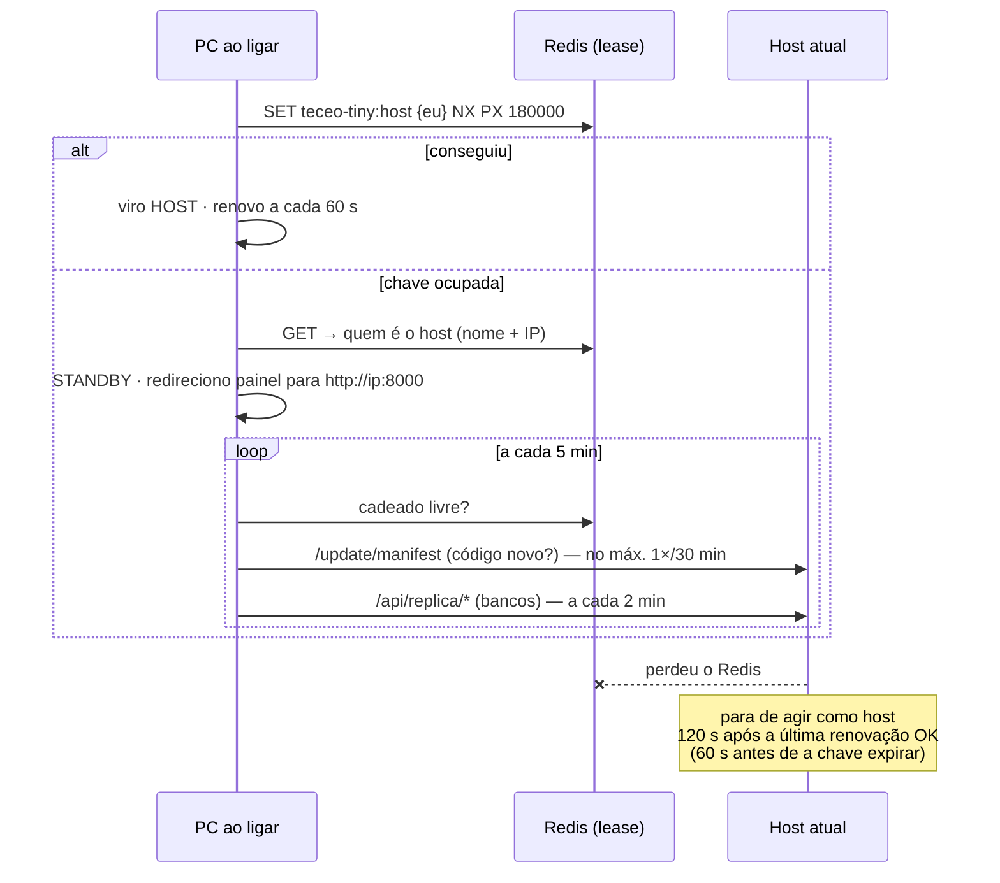
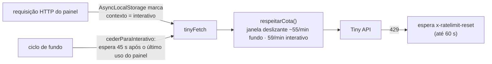

# 2. Arquitetura

## Visão geral

Um único processo Node.js, sem dependências de runtime, que roda em cada PC da loja. Em qualquer momento exatamente um deles é o **host** (o único que escreve nas plataformas externas); os outros são **standby** (servem redirecionamento do painel, mantêm réplica dos bancos, baixam código novo e ficam prontos para assumir).

## Os ciclos do host

Tudo é *polling* com intervalos configuráveis por `.env`. Não há webhooks porque a Teceo exigiria endereço público e a configuração de webhooks do Tiny é global da conta e dependente do plano.

| Ciclo | Intervalo | O que faz |
|---|---|---|
| Clientes → pedidos | 60 s | Busca clientes e pedidos APPROVED não sincronizados na Teceo; cria/casa contato no Tiny; cria o pedido (dividido em pronta-entrega e pré-venda quando necessário); reporta SUCCESS/ERROR. Backoff: 3 tentativas rápidas, depois 30 min por pedido em erro. |
| Edições e cancelamentos | 30 min | Tiny → Teceo: status (cancelado/reaprovado) e itens (reverse sync assíncrono, com validação de disponibilidade contra o tipo do pedido). Teceo → Tiny: cancelamento, protegendo pedido faturado. Anti-eco: atualiza o estado local antes de espelhar. Devolução automática de peças à cesta quando cabe. |
| Estoque Tiny → Teceo | 6 h (varredura) | Delta por SKU; guarda de escrita; congela SKU duplicado; retém produto novo com saldo alto; sentinela de base resetada. |
| Baixa por nota fiscal | 10 min | Nota que o Tiny lançou: espelha só os SKUs dela na Teceo. Nota que o Tiny recusou lançar: deduz item a item nas duas plataformas, com livro por item. |
| Fotos e cadastro | 30 min | Mídias por cor da Teceo → anexos do Tiny (idempotente, filtrando as já convertidas para internas). Produto alterado no Tiny → PATCH na Teceo. |
| Histórico e caches | 30 min / 6 h | Diff campo a campo de produtos e clientes; cache de vendas e de notas fiscais (retomável, 250 notas por rodada). |
| Financeiro | desligado | Pronto (contas a receber → Teceo), aguardando liberação do recurso pela plataforma. |
| Backup | diário | `VACUUM INTO` de cada banco, mantém 14 cópias. |
| Vigia de saúde | 10 min | Transição de ciclo para PARADO/ERRO dispara notificação nativa do Windows; anti-spam por ciclo. |
| Retomada de escritas pendentes | 5 min | Ver [`05-confiabilidade.md`](05-confiabilidade.md). |

## Host e standby

**Por que um lease na nuvem e não a rede local.** A primeira versão decidia host/standby olhando só os PCs da rede (`PEERS`). Fora da rede (feira, casa, sede nova) cada máquina "não via host" e virava host sozinha. O lease em Redis (`SET NX PX`, atômico) resolve isso com ~15 mil comandos por mês no plano gratuito. Se o Redis está inacessível, o comportamento é **fail-closed**: fica sem host em vez de dois.

**Fencing token não é possível** — Tiny e Teceo não aceitam um número de época nas escritas. A margem de segurança no lease (parar antes de a chave expirar) é o equivalente prático, e a janela de split-brain foi medida por simulação (ver post-mortem 3).

## Distribuição de código e dados

**Auto-update pela rede.** O host serve `GET /update/manifest` (hash por arquivo, raízes permitidas) e `GET /update/arquivo?p=` (com lista branca contra *path traversal*). O standby compara, baixa só o que difere e reinicia sozinho. O `.env` também vem do host (uma troca de chave se propaga), preservando apenas a linha `PEERS` local. Pastas de diagnóstico ficam fora do manifesto — uma lição: enquanto `scripts/` entrava, cada script criado no host fazia todos os standbys reiniciarem.

**Réplica dos bancos.** O host serve `GET /api/replica/<banco>` com cópia consistente via `VACUUM INTO` (lê o WAL). O standby baixa a cada 2 min, valida cabeçalho e abertura, e guarda como "última boa". Ao assumir, grava um marcador e reinicia; na subida, troca o banco local pela réplica **antes** de qualquer conexão abrir (e apaga `-wal`/`-shm` órfãos, senão o WAL velho seria reproduzido sobre o banco novo). Janela de perda residual: 2 min de escritas do host que caiu.

**Sincronia de catálogo.** Além da réplica, o standby recebe `GET /api/sync-local` (catálogo + saldos) com regra de **prioridade por data** — o valor mais novo vence, nunca o anterior — para que uma atualização atrasada não sobreponha um lançamento recente. Standby **nunca** consulta o Tiny: a cota é do host.

## Agente de bandeja

Um executável C# (`TeceoTinyAgente.exe`) compilado com o `csc` que já vem no .NET Framework do Windows — nada baixado, sem SmartScreen. Fica ao lado do relógio, sobe o serviço no logon (registro `Run` + tarefa agendada como segunda garantia), religa se cair, e a cada ~45 s busca ordens no host (conexão de **saída** — nenhuma porta aberta). Ordens: iniciar/parar/reiniciar/atualizar o serviço; manutenção (ler arquivo do projeto, rodar `scripts/*`, PowerShell) — estas exigem uma **senha mestre** separada do login, cuja verificação é autoritativa no host (os standbys perguntam a ele).

Isso substituiu `.vbs` + tarefas agendadas que abriam janelas de console nos PCs das pessoas e falhavam com "recursos de memória insuficientes" numa das máquinas.

## Cliente do Tiny: convivendo com 60 req/min

Antes disso, a busca por descrição no painel levava de 30 s a 3 min (356 esperas de 429 numa hora) porque a varredura de estoque saturava a cota no boot. Depois: catálogo local primeiro (0,02 s), Tiny só se o catálogo não tiver nada; varredura de estoque nunca no boot e sempre cedendo a vez.

## Dados

Quatro arquivos SQLite (`node:sqlite`, WAL, `busy_timeout` 15 s):

| Arquivo | Conteúdo |
|---|---|
| empresa A | tudo da integração Teceo ↔ Tiny: estado de pedidos, logs de sync, `stock_state`, livros de idempotência (`estoque_op`, `nf_baixadas`, `nf_baixa_item`, `cesta_devolucao`, `saldo_reparado`), caches de vendas e notas, catálogo, marcações manuais, movimentações |
| empresa B | espelho do Bling (produtos, contatos, pedidos, NFe/NFC-e com itens, canais), auditoria, feiras, genéricos |
| empresa C | idem, para a terceira conta do Bling |
| acesso | pessoas, hashes de senha (scrypt + salt), sessões, papéis e permissões por empresa, senha mestre, rótulos dos computadores, marca de migração |

A separação é física: o SQLite não faz JOIN entre arquivos, e um script de conferência prova que nenhuma tabela de negócio é comum. O banco de acesso guarda **só identidade** — "quem é a pessoa" não é dado de empresa.

## Interface

HTML gerado no servidor, sem framework, com um componente `casca()` compartilhado que aplica a paleta da empresa (azul, areia, verde), cabeçalho, navegação em abas e componentes de KPI/card/tabela. Chart.js é servido localmente (o CDN referenciado originalmente devolvia 404 e a loja não pode depender de internet para ver um gráfico). O painel virou PWA para uso no celular na contagem.

## Segurança

Login único em `/login` (cookie HttpOnly, SameSite=Lax, 7 dias; trocar senha derruba as sessões). Papéis: dono do sistema, administrador da empresa, operador, consulta; permissões marcáveis por tela. Portão de login aplicado no **início** do tratamento da requisição, com uma única função `rotaLiberadaSemLogin()` compartilhada por todos os pontos de verificação (lição do post-mortem 7). Rotas de máquina (réplica, update, agente) restritas a IP privado ou token. Senha mestre para execução de código, redefinível apenas por e-mail fixo no código (não no banco). Credenciais só em `.env`, nunca em documentação; `.gitignore` como lista de permissão.

---

## Adendo — o que entrou entre 02/09 e 18/09

### Módulos novos por empresa (código compartilhado, uma instância por banco)

| Módulo | O que faz |
|---|---|
| **Pedidos** (`pedidos.ts`, `bling/pedidos.ts`) | Tela por empresa a partir do espelho local (custo de API zero, abre sem internet): KPIs, filtros, busca por nº/cliente/documento/SKU/peça, itens sob demanda, selo de estoque por item (sem estoque / negativo / sem cadastro), emblema de NF, impressão A4 com coluna de conferência. Nas empresas do ERP de varejo, **edição** que grava no ERP com prévia obrigatória, só em pedido aberto ou em digitação, com as parcelas acompanhando o total na proporção — e bloqueio explicado quando o pedido já chega inconsistente. |
| **Notas fiscais** (`notas.ts`, `bling/notas.ts`) | Aba por empresa, só leitura: situações mapeadas por família (os dois ERPs usam números diferentes para "cancelada"), canceladas em vermelho e fora das somas, filtro NF-e × NFC-e, relatório imprimível respeitando os filtros da tela. |
| **Financeiro** (`financeiro.ts`, `financeiroErp.ts`) | Contas a receber, a pagar e caixa nas 3 empresas. Fonte principal = parcelamento do ERP (nos dois ERPs, as contas nascem da nota). Conta do ERP é atualizada a cada ciclo e nunca removida aqui; conta manual nunca é tocada pela sincronia; caixa é nosso, com data do movimento digitada e sem duplicar. Permissão própria, fora dos papéis prontos. |
| **Relatórios do ERP de varejo** (`bling/relatorios.ts`) | Mesmo motor que a empresa principal já tinha, adaptado: base = nota autorizada, valor = `valorNota` (com desconto) ou soma dos itens, modelo (NF-e/NFC-e) atravessando todos os relatórios. Período personalizado (`periodo.ts`) e folha de impressão por relatório nas 3 empresas. Dias sem movimento aparecem com zero. |
| **Planilha passiva** (`planilhaPassiva.ts`) | A cada hora, em **cada** PC (antes do desvio host/standby), regrava 12 CSVs (estoque, pedidos e itens por empresa) a partir do espelho local. Nome fixo + cópia de ontem; espelho vazio nunca sobrescreve. Pasta fora do manifesto de distribuição. |
| **Trava manual** (`sync/travaManual.ts`) | Toda gravação manual carimba o SKU por 30 min; a varredura automática pula o carimbado. Cobre a corrida entre "o ciclo leu" e "o ciclo escreveu", sem congelar o produto. |
| **Espelhamento com checkpoint** (`sync/espelhamento.ts`) | Passe da varredura Tiny → Teceo com livro por SKU; retoma passe aberto com menos de 12 h; todo caminho de saída do laço marca o SKU (inclusive o `catch`). Botões "forçar" e "recomeçar" na aba de saúde. |
| **Cadastro sincronizado** (`sync/replica.ts`) | Além da réplica de arquivo (adoção só no failover), o banco de acesso é sincronizado **linha a linha** nos standbys a cada 2 min. Ver PM16 para as duas políticas. |
| **Folgas do destravar** (`destravaFolga.ts`) | Livro-razão de cada desbloqueio que infla o total na plataforma B2B e passe de 20 min que devolve ao saldo real quando o pedido sai de aprovação (ou em 24 h). Ver PM19. |
| **Verificador de rotas** (`rotasEsperadas.ts`) | 43 rotas escritas à mão com o que cada uma precisa devolver; roda como ciclo da aba Saúde a cada 6 h. Ver PM18. |
| **Marcas** (`marcas/`) | Símbolo e logo completo de cada empresa servidos pelo próprio painel; a casca ganhou cabeçalho central com emblemas das outras empresas nas diagonais. |

### Cliente do ERP principal — revisão da cota

Depois do PM15, a marcação de "uso interativo" saiu do servidor HTTP e passou a ser feita pelo próprio `tinyFetch`, só quando a chamada realmente gasta cota. Um 429 bloqueia todas as chamadas até a cota virar, com espera sorteada (±25%) e teto de 6 tentativas (depois o checkpoint marca o SKU e o ciclo anda). Teto adaptativo com punição suave (×0,9, no máximo uma a cada 15 s), piso 25 e recuperação por tempo. Cedência ao painel de 10 em 10 SKUs, máximo 30 s. A renovação do lease de host passou a ser tentada a cada 15 s (a margem anti-split-brain não mudou), e o motivo da perda distingue "outro host" de "sem contato".

### Distribuição — o que "mesma versão" significa

A versão de um PC é o hash de todos os arquivos distribuídos **exceto** `.env` (difere por máquina de propósito) e o `.exe` do agente (em uso, não pode ser sobrescrito). Extensões de backup são ignoradas no pacote. `scripts/` e `planilhas/` ficam fora do manifesto. Uma rota só leitura devolve o manifesto para um script de diff host × standby.

### Conferência diária

`scripts/conferencia-relatorios.ts` (só leitura, ~2 min): relatórios do painel × os dois ERPs, dia a dia, 90 dias, 3 empresas — contagem e situação de notas, faturamento por dia e por mês, pedidos por mês, canceladas, contas a receber, os 40 maiores saldos e a consistência interna dos relatórios (KPI = por mês = por dia = por modelo; peças = curva de grade; ABC = soma por produto). Primeira rodada achou que o espelho da terceira empresa nunca rodava sozinho.
