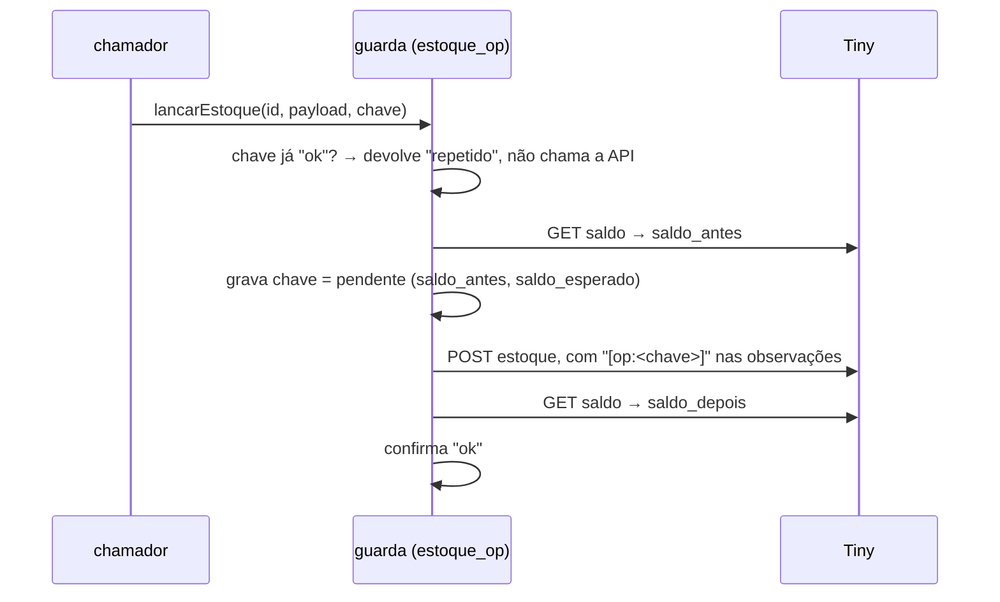

# 5. Confiabilidade: guarda de estoque, retomada automática e simulação

Depois do PM1 o dono do processo fez duas exigências, textualmente:

> "coloque em código para que o bug nunca mais dispare, sem chance de voltar, mesmo que por meios semelhantes"

> "operação relativa pendente não pode ter conferência humana todas as vezes; deve ser salva de onde parou e continuada quando possível, mesmo que use mais código, requisição ou memória. Evitar intervenção humana a todo custo."

Este documento descreve o que foi construído para atender às duas.

## Guarda de escrita

Toda escrita de estoque no ERP passa por uma única função:

```ts
tiny.lancarEstoque(idProduto, payload, chave)
```

A `chave` identifica a **operação de negócio** e é obrigatória na assinatura — sem ela não compila. Nenhum script, tela ou ciclo escreve estoque por fora.

| Chamador | Chave |
|---|---|
| Baixa por nota fiscal | `nf:<nf_id>:<sku>` |
| Devolução à cesta em cancelamento | `cesta:<pedido_id>:<sku>` |
| Carga por planilha / carga inicial | `carga-planilha:<sku>:<iso>` |
| Contagem manual | `contagem:<sku>:<iso>:<aleatório>` (pode repetir de propósito) |
| Scripts de reparo | `reparo-dupla:<nf>:<sku>`, `reparo-saldo:<nf_id>:<sku>` |

Sequência de uma escrita:



Custo: duas leituras por escrita. Aceito. A intenção é gravada **antes** de chamar a API — se o processo cair entre a escrita e a confirmação, a retomada encontra a operação pendente com tudo que precisa para decidir.

## Retomada automática

Roda no host ao subir e a cada 5 min. Para cada operação `pendente` ou `falhou`, lê o saldo atual e decide sozinha:

| Situação encontrada | Ação |
|---|---|
| Operação é balanço (valor absoluto) | Repete — é idempotente |
| Saldo atual = esperado | O ERP aplicou; confirma |
| Saldo atual = antes | Não aplicou; aplica agora |
| Outro valor | Desconta os movimentos que **nós mesmos** confirmamos no mesmo produto depois dela (estão todos em `estoque_op`) e decide |
| Ainda não bate | Fica pendente, tenta na próxima rodada (o saldo costuma se acomodar) |
| Mais de 6 rodadas sem decidir | Marca `conferir` e loga erro alto — **a exceção, e medida** |

Oito cenários testados sem tocar no ERP: confirma sem reaplicar; reaplica uma vez; indecisa espera; balanço repete; desconta outra operação nossa; acomoda na rodada seguinte; desiste no limite; **nunca aplica duas vezes**.

O que tornaria a retomada 100% certa seria ler o log de movimentação do ERP, onde a chave `[op:…]` ficaria legível. O endpoint existe mas o aplicativo não tem o escopo (403) — registrado como pendência de configuração, não de código.

## Harness de simulação: um ERP falso

Para provar que as travas seguram, um ERP falso (`fake-erp.ts`, HTTP local) imita Tiny + Teceo com injeção de falhas, e o **código real** roda contra ele com bancos-cópia e `.env` próprio. Sete cenários, cada um um erro clássico de estoque em integrações:

| # | Cenário | 1ª rodada | Após correção |
|---|---|---|---|
| S1 | Lote de nota interrompido no meio e reprocessado | **FALHOU** | passa |
| S2 | ERP aplicou, mas a resposta se perdeu (processo caiu antes de confirmar) | passa | passa |
| S3 | Venda concorrente entre a leitura do saldo e a gravação (*lost update*) | **FALHOU** | passa |
| S4 | Nota pede mais do que existe (saldo iria a negativo) | passa | passa |
| S5 | Nota já baixada por **outro** PC (livro compartilhado via réplica) | passa | passa |
| S6 | Contagem manual com a tela desatualizada (venda no meio) | passa | passa |
| S7 | Mesma nota reprocessada após o serviço reiniciar no meio do lote | **FALHOU** | passa |

As três falhas tinham duas causas de raiz na baixa por nota: a nota era marcada como feita mesmo com item falhando (S1/S7), e a baixa usava balanço "saldo − q" — uma venda entrando entre ler e gravar era apagada (S3). Correções: nota só fecha quando todos os itens terminam; dedução **relativa** (`tipo: 'S'`) em vez de valor absoluto.

Uma segunda auditoria, com uma "Tiny falsa" em memória e banco isolado (`DB_PATH` temporário — lição do PM8: nunca escrever no banco vivo por fora), cobriu a guarda em 5 cenários (baixa em dobro, queda após aplicar, queda antes de aplicar, corrida, balanço idempotente): 5/5. E uma terceira, para o lease de host, mediu a janela de split-brain antes e depois da correção (PM3). Os três simuladores ficaram como testes de regressão.

## Auditoria de classes clássicas

| Classe | Onde está defendida |
|---|---|
| Dupla dedução | `nf_baixadas` (nota) + `nf_baixa_item` (item, na hora) + chave da guarda |
| Lost update | dedução relativa; balanço só quando o objetivo é fixar um número |
| Saldo negativo por dedução | pula o item e loga (genéricos passam de propósito) |
| Reserva contada como venda | sync manda saldo físico, não disponível |
| SKU ambíguo | congela SKU com produto duplicado e avisa |
| Produto recriado com id novo | revalida id pelo catálogo |
| Base remota resetada | sentinela no ciclo de estoque |
| Devolução em cancelamento duplicada | `cesta_devolucao` (1 por pedido+SKU) + chave; só devolve se houve contagem depois da integração |
| Estoque que "nasce" errado | guarda de produto novo |
| Dois hosts | lease atômico, fail-closed, margem medida |
| Réplica velha na tomada de host | janela de 2 min; caso residual (nota travada nos últimos 2 min + failover) documentado como risco conhecido |
| Corrupção em queda | WAL |
| Multi-depósito, clock skew, float | verificados; não se aplicam ou risco baixo — registrado |

## Regras que ficaram para toda escrita externa

1. Registro local **por operação**, gravado **antes** de chamar a API e sobrevivendo a falha (tentativas em `database is locked`, fallback em arquivo).
2. Todo caminho de erro testado, não só o de sucesso.
3. Toda operação reexecutável sem repetir efeito.
4. Foto antes e depois; só confirma quando a variação bate exatamente; senão, não encosta e marca para conferir.
5. Prévia é o padrão; aplicar é explícito.
6. Perder o registro de uma peça já devolvida é o pior erro possível — falhar em anotar não pode nem interromper a execução nem passar em silêncio.

## Adendo — o que setembro acrescentou

**Invariante em vez de "onde bate".** O lote v2 de liberação de reservas exige `saldo final == saldo inicial` por SKU, verificado com foto ao vivo antes e depois; divergência para a nota e o lote. 739 reservas soltas com saldo idêntico em todas. A versão anterior devolvia só onde a queda batia exatamente e deixou o buraco de −384 peças (PM13).

**Livro-razão por automação, com chave por origem.** `estoque_op` (guarda), `nf_baixa_item`, `cesta_devolucao`, `reserva_v2_item`, `reserva_v2_cancel`, `saldo_reparado`, `saldo_zerado`, `destrava_folga`, `espelho_varredura`, `trava_manual`. Foi o que permitiu, em dez minutos, distinguir "o ERP devolveu peça" de "a nossa regra da cesta devolveu peça" (PM17). Conferir o resultado não basta; conferir a autoria é o que decide.

**Compensar só o delta.** Nunca puxar um SKU para um número absoluto anterior: outra pessoa pode ter lançado no meio, e o valor absoluto apagaria o trabalho dela.

**Token por tentativa.** Um lote longo que lê o token OAuth uma vez no início vira 401 em massa depois de 4 h — e 401 nunca pode ser anotado como "recusado" (PM13).

**Retomada também para varreduras, não só para escritas.** Checkpoint por SKU (D15). Três reinícios no meio de um passe: zero SKUs perdidos.

**Sinais de "mesma versão" e de "painel em uso" precisam medir a coisa certa.** Hash do código sem o ambiente; uso interativo marcado só por chamada que gasta cota (PM15).

**A saúde vigia telas, não só ciclos** (PM18): 43 rotas com expectativa explícita, mesmo semáforo, mesmo alerta.

**Conferência diária por porta diferente.** Script só leitura que bate relatórios × os dois ERPs dia a dia; auditoria de canceladas por três caminhos (PM20).

**Harness de simulação para cada mecanismo novo:** trava manual 13/13, planilha passiva, espelhamento 22/22, página de espelhamento 12/12, cota 9/9 (incluindo "recusa a cada 30 s por 30 min: o teto ainda sobe"), manifesto 8/8, sincronização de cadastro 4/4 (o 4º pegou um defeito real), guarda de produto novo 12/12 — todos em banco descartável via `DB_PATH`, nunca no banco vivo.

**Erros meus, registrados com esse nome:** previsão de hora extrapolada de 15 min de amostra (PM15); "nenhum dos três tem as correções" concluído a partir de um sinal que não media código (PM15); compensação que apagou uma devolução correta (PM17); duas cópias velhas de arquivo por cima de código novo no mesmo dia (PM18); a primeira versão do doc do PM15 apontando a causa errada, mantida no histórico com o aviso.
